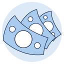

# MHC Icon System — Step 1 output

Generated 2026-08-12 from Figma **Imagery (Copy) → Icons** page (`KUaCMgRNNRXs9UotmT6ptF`).
Nothing in Figma was modified.

## The point of this folder

Figma was the only place the icons existed, so when a design got converted to HTML there was no
name-to-artwork map to consult. The result was either a substituted lookalike or an element that
rendered as nothing. **This folder is the map.** Figma stays the visual browser; `icons.json` is
what a build actually reads.

## What's here

| File | What it is |
|---|---|
| `contact-sheet.html` | Every icon on one page. Open this first. Click a tile to copy its key. |
| `icons.json` | The manifest — 337 entries, keyed by name. This is the source of truth for builds. |
| `mhc-icons.css` | All 221 monochrome glyphs as CSS masks. 511 KB — a library, not a shippable sheet. |
| `subset.py` | Emits a minimal sheet containing only the icons a page actually uses. |
| `svg/{small,large,other}/` | 337 individual SVG files. |
| `verify.html` | Render regression test — proves tinting, sizing, and the missing-icon fallback still work. |

## Numbers

| | |
|---|---|
| Component sets on the Figma page | 359 |
| Identical duplicates auto-merged | 22 |
| **Icons after dedupe** | **337** |
| Monochrome — ship via CSS mask | 221 |
| Multicolour — ship as SVG file | 116 |
| Name collisions still needing a decision | 43 |
| Icons whose size variants don't scale | 36 |

## How to use it

**Monochrome glyphs** — masked, so they inherit `currentColor` and need no per-theme variant:

```html
<link rel="stylesheet" href="icons.subset.css">
<i class="mhi mhi--icon-small-system-heart"></i>
<i class="mhi mhi-32 mhi--icon-small-system-close"></i>
```

Sizes: `mhi-16` `mhi-20` `mhi-24` (default) `mhi-32` `mhi-40`, or set `width`/`height` yourself.

**Multicolour illustrations** — the palette is baked into the artwork, so these are *not* themeable:

```html

```

**Before shipping**, subset the sheet:

```bash
python3 subset.py build/*.html -o build/icons.css
```

It exits non-zero and names any icon key that doesn't exist, so a bad reference fails the build
instead of shipping.

## Two failure modes found and fixed during the build

Both were reproduced in a browser, not reasoned about:

1. **`~` is not legal in a CSS class name.** The first pass suffixed collisions `name~a` / `name~b`.
   CSS parses `~` as a sibling combinator, so those rules silently never matched. Collisions are now
   suffixed `-2`, `-3`.
2. **An unknown icon key used to render as a solid filled square** — `.mhi` sets
   `background: currentColor`, so with no mask the browser paints the entire box. This is very likely
   what you were seeing as "it gets converted to something else." Unknown keys now render as a
   crossed box, which is impossible to mistake for real artwork.

## Open decisions — yours, not mine

**43 name collisions.** Same name in Figma, genuinely different artwork. Section 1 of the contact
sheet shows each pair side by side. Some are simple duplicates of unequal quality; others are
mislabelled — `icon-large-activity-stationary-bike` is a *runner*, and `-2` is the actual bicycle.
Until these are resolved, the name is ambiguous and no build can resolve it reliably.

**36 icons with broken scaling.** Section 2. These are the icons8 imports: the size variants are the
same fixed-pixel artwork dropped into progressively larger frames, so the glyph stays put while the
padding grows. Renaming won't fix them — they need redrawing.

**116 multicolour illustrations have hard-coded hex fills and zero variable bindings.** They cannot
follow a theme, so they will not survive a partner reskin or a dark mode. Binding them to colour
variables is the highest-leverage item in the whole system, and it's a one-way door — flagged rather
than done.

## What Step 1 does *not* do

No Figma edits. No renames. No variable binding. No iOS or Android build outputs. Those are Steps 2
onward, and the cross-platform rule stays: **one source SVG, three build outputs — never three
hand-maintained sets.**
